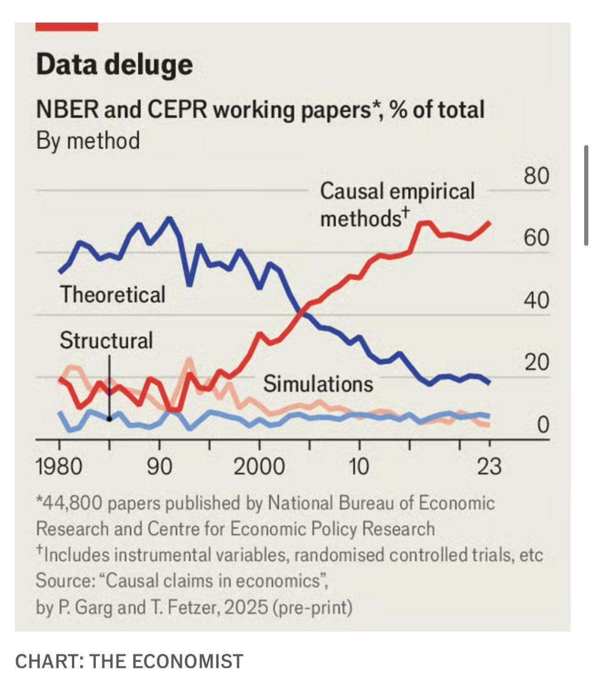

## Overview

\tableofcontents

# 1. Introduction to Econometrics

## What is Econometrics?

::: {.incremental}
- Application of statistical methods to economic data.
  - Estimating parameters in economic models 
  - Using historical patterns to *predict* future economic outcomes
  - Most importantly, inference on the relationship between economic variables,
  especially **causal** relationships

- These skills are extremely valuable to any quantitative field.
:::

## History of Data in Economics

:::: {.columns}

::: {.column width="38%"}
\centering
\vspace{0.2em}
{width=95%}
:::

::: {.column width="62%"}
\small
::: {.incremental}
1. **Qualitative & Philosophical** (Pre-20th C.)
   - Descriptive political economy and deduction (Smith, Ricardo).
2. **Pure Theory** (Early--Mid 20th C.)
   - Formal mathematical models and axiomatic proofs (Walras, Arrow-Debreu).
3. **The Empirical Turn** (Late 20th C.)
   - Rise of computing and regression analysis on observational datasets.
4. **Causal Empirical Work** (1990s--2000s)
   - The *Credibility Revolution*: randomized control trials and "natural" experiments to uncover **causal** effects.
5. **Replicable Science** (Today)
   - Open data and reproducible code pipelines.
:::
:::

::::

## Why Stata?

- Computation and more data have allowed economics to become an empirical field.
- Stata is a widely-used statistical package in economics and social sciences.
- Other options: R, Python, Julia.
- Stata is user-friendly and doesn't require a traditional coding background.

## Accessing Stata at Columbia

- **Download through Columbia (Recommended):**
  - Download via CUIT: [cuit.columbia.edu/content/stata](https://cuit.columbia.edu/content/stata) (login with your UNI).
  - The latest version available is **Stata 19**.

\vspace{0.2em}

- **On-Campus Computer Labs:**
  - Find lab locations & hours: [cuit.columbia.edu/.../locations-hours](https://www.cuit.columbia.edu/computer-lab-technologies/locations-hours).

\vspace{0.2em}

- **Remote PC Access:**
  - Access Stata remotely from your PC: [cuit.columbia.edu/computer-lab-technologies](https://cuit.columbia.edu/computer-lab-technologies).

\vspace{0.3em}

**Important Caveats:**

- Not all systems have the current Stata version (won't affect this course).
- Remote availability can be limited during peak times — **start problem sets early!**


# 2. Stata Basics & Workflow

## The Stata Interface

- **Command Window:** For typing quick, interactive commands.
- **Results Window:** Displays command history and formatted numerical output.
- **Variables & Properties:** Shows variable names, storage types, formats, and labels.
- **Review Window:** Lists previously executed commands.

\vspace{0.5em}

- **Always work from a do-file (`.do`)**, *not* from the interactive console. 
  This guarantees that your research is 100% **reproducible** and auditable.

## Setting Up a Clean Do-File Header

Start every do-file with standard initialization commands:

```stata
clear all             // clear existing data from memory
capture log close     // close any open log files
set more off          // disable pause prompts during long output
log using "recitation1.log", replace text
```

\vspace{0.5em}

When your script finishes, close the log:

```stata
log close
```

Your do-file should import your data and produce the same results every time.
I highly recommend you do this on your problem sets.

## Saving Output

- The `.log` file saves the output of your do-file. 
- In practice economists often instead produce tables of their results using `esttab` or `estout`.
- For this class, simply screenshotting results directly from the console or a log-file will be sufficient. 

# 3. Loading and Saving Data

## Built-In Datasets: `sysuse`

- Stata includes pre-installed datasets for practice.
- We will use the 1978 Automobile dataset (`auto.dta`):

```{stata}
*| output: false
sysuse auto, clear
```

- The `clear` option discards whatever is in memory so the new dataset loads cleanly.

## Saving and Loading Data: Stata Format (`.dta`)

- **Set working directory:**
  ```{stata}
  *| output: false
  cd "/Users/faizessa/Library/CloudStorage/Dropbox/Mac/Documents/ta/ECONUN3412/output"
  ```

- **Saving data to Stata format (`.dta`):**
  ```{stata}
  *| output: false
  save "auto.dta", replace
  ```

- **Importing data from Stata format (`.dta`):**
  ```{stata}
  *| output: false
  clear
  use "auto.dta"
  ```

## Saving and Loading Data: CSV Format (`.csv`)

- **Exporting data to CSV format (`.csv`):**
  ```{stata}
  *| output: false
  export delimited using "auto.csv", replace
  ```

- **Importing data from CSV format (`.csv`):**
  ```{stata}
  *| output: false
  clear
  import delimited "auto.csv"
  ```

## Saving and Loading Data: Excel Format (`.xlsx`)

- **Exporting data to Excel format (`.xlsx`):**
  ```{stata}
  *| output: false
  export excel using "auto.xlsx", firstrow(variables) replace
  ```

- **Importing data from Excel format (`.xlsx`):**
  ```{stata}
  *| output: false
  clear
  import excel "auto.xlsx", firstrow
  ```
  *(Note: `firstrow` tells Stata that row 1 contains the variable names)*

# 4. Inspecting & Modifying Data

## Inspecting the Dataset

```{stata}
summarize mpg price weight
```

- `describe`: Displays storage formats, variable labels, and value labels.
- `summarize`: Computes observations, sample mean, standard deviation, min, and max.
- `browse`: Opens a read-only spreadsheet viewer for inspection.

## The `edit` Function vs. Scripted Editing

- In Stata, the `edit` command opens the interactive Data Editor GUI:
  ```stata
  edit           // opens editable spreadsheet window
  ```

\vspace{0.3em}

- **Avoid Manual `edit`:**
  - Manual point-and-click changes cannot be tracked, audited, or replicated.
  - One accidental keystroke can corrupt your dataset.

\vspace{0.3em}

- *Always* use Stata commands (`generate`, `replace`) in your do-file so every change is recorded.

## Scripted Transformations: `generate` & `replace`

\scriptsize

```{stata}
// Create gallons per 100 miles
generate gpm = (1 / mpg) * 100

// Create a dummy indicator for high fuel economy (mpg >= 25)
generate high_mpg = (mpg >= 25)

summarize gpm high_mpg
```

\normalsize
\vspace{-0.2em}
\small

- Use `generate` to create a brand new variable.
- Use `replace` to update values of an existing variable.

# 5. Two-Sided Hypothesis Testing in Stata

## Setting Up the Two-Sided Hypothesis

- **Research Question:** Is the average fuel economy of 1978 cars different from 20 mpg?
- **Parameter of Interest:** Population mean $\mu = E[\text{mpg}]$

\vspace{0.6em}

- **Two-Sided Hypotheses:**
  $$H_0: \mu = 20 \quad \text{vs.} \quad H_1: \mu \neq 20$$

\vspace{0.4em}

- **Significance Level:** $\alpha = 0.05$ ($\alpha/2 = 0.025$ in each tail).

## Step 1: Summary Statistics from Stata

```{stata}
summarize mpg
```

From the summary table, we extract our sample estimators:

- Sample size: $n = 74$
- Sample mean: $\bar{Y} = 21.2973$
- Sample standard deviation: $S = 5.7855$ ($S^2 = 33.472$)

## Step 2: Critical Value & $p$-Value Approaches (by Hand)

**1. Standard Error & $t$-Statistic:**
$$\mathrm{SE}(\bar{Y}) = \frac{5.7855}{\sqrt{74}} = 0.67255, \qquad t^{\text{act}} = \frac{21.2973 - 20}{0.67255} = 1.9289$$

. . .

**2. Method 1: Critical Value Rule ($\alpha = 0.05$):**

- Two-sided threshold: $c_{\alpha/2} = 1.960$.
- Since $|t^{\text{act}}| = 1.9289 \le 1.960 \implies$ **Fail to reject $H_0$ at 5%**.

. . .

**3. Method 2: $p$-Value Rule ($\alpha = 0.05$):**

- $p\text{-value} = 2 \cdot [1 - \Phi(1.9289)] = 0.0576$.
- Since $p\text{-value} = 0.0576 > 0.05 \implies$ **Fail to reject $H_0$ at 5%**.


## Step 3: Confidence Interval Approach (by Hand)

**Method 3: Construct the 95% Confidence Interval:**
$$\text{CI}_{95\%} = \left[ \bar{Y} - 1.960 \cdot \mathrm{SE}(\bar{Y}), \quad \bar{Y} + 1.960 \cdot \mathrm{SE}(\bar{Y}) \right]$$
$$\text{CI}_{95\%} = [21.2973 - 1.960(0.67255), \; 21.2973 + 1.960(0.67255)] = [19.979, \; 22.616]$$

\vspace{0.3em}

- **Duality Rule:** Reject $H_0: \mu = \mu_0$ at level $\alpha \iff \mu_0 \notin \text{CI}_{1-\alpha}$.
- **Decision:** Since $\mu_0 = 20 \in [19.979, \; 22.616]$, we **fail to reject $H_0$ at the 5% level**.

\vspace{0.4em}

> **Equivalence:** Critical Value, $p$-Value, and Confidence Interval approaches are mathematically identical and always yield the same decision.

## Step 4: Automated Testing with `ttest`

In practice, Stata computes all three approaches simultaneously with a single command:

\vspace{-0.3em}
\scriptsize

```{stata}
ttest mpg == 20
```

\normalsize

## Comparing `ttest` Output to Our 3 Approaches

Stata's `ttest` output displays all three methods in a single table:

- **1. Critical Value:** $t = 1.9289$ (with $df = 73$) compared against $\pm 1.960$.
- **2. $p$-Value:** Center column gives two-sided $p\text{-value} = 0.0576$ ($> 0.05$).
- **3. Confidence Interval:** Right columns report $[19.9569, \; 22.6377]$ (contains $20$).

\vspace{0.4em}

- **Universal Conclusion at $\alpha = 0.05$:** **Fail to reject $H_0: \mu = 20$** in favor of $H_1: \mu \neq 20$.

\vspace{0.3em}

Stata's automated output identically mirrors our manual calculations across all 3 testing approaches.

## Useful Stata Commands & Resources

\vspace{0.1em}
\footnotesize

:::: {.columns}
::: {.column width="52%"}
**Commands Covered Today:**

- **Load/Save:** `sysuse`, `use`, `save`, `import`, `export`
- **Inspect:** `describe`, `summarize` (`detail`)
- **Variables:** `generate`, `replace`
- **Inference:** `ttest`

\vspace{0.2em}

**Coming Up in Econometrics:**

- **Regression:** `regress` (OLS estimation)
- **Association:** `correlate` (correlation & covariance)
- **Advanced Variables:** `egen` (group stats, rankings)
- **Merging:** `merge`, `append`
- **Visuals:** `twoway scatter`, `lfit`, `graph`
:::

::: {.column width="48%"}
**Recommended Online Resources:**

- [UCLA IDRE Stata Portal](https://stats.oarc.ucla.edu/stata/)  
  *(Tutorials, code examples, & modules)*
- [Official Stata Cheat Sheets](https://www.stata.com/bookstore/statacheatsheets.pdf)  
  *(Syntax & command quick-reference)*
- [Statalist Discussion Forum](https://www.statalist.org/forums/)  
  *(Q&A community for econometrics)*

\vspace{0.3em}

\textbf{Built-in Stata Help:}\newline
Type \texttt{help <command>} (e.g., \texttt{help regress}) for documentation, syntax options, and return values.
:::
::::

\normalsize


